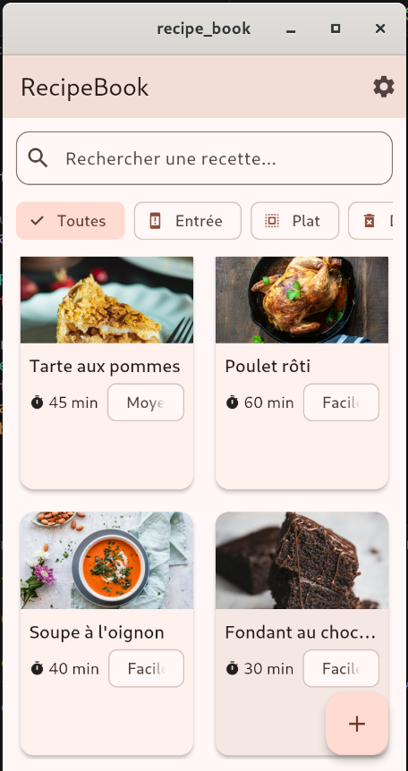
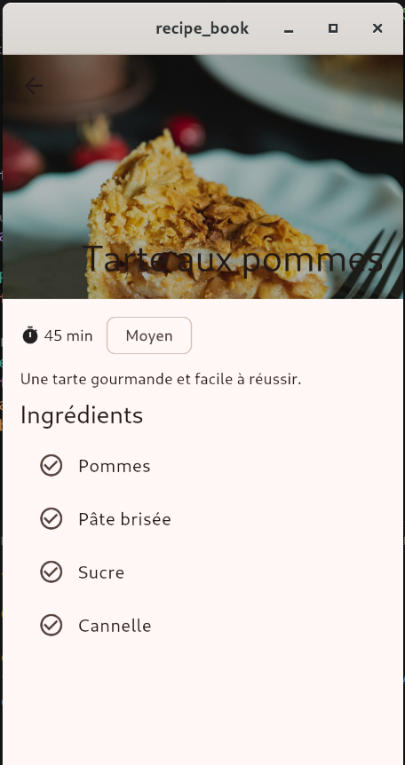
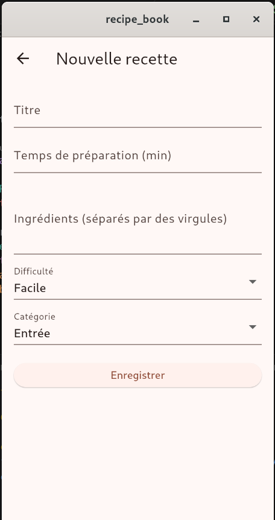
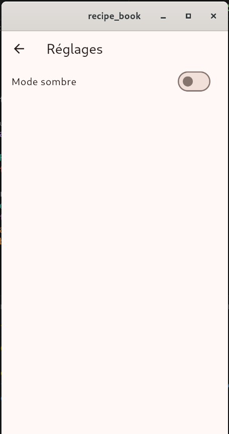

# RecipeBook 🍲

Application Flutter multi-écrans de gestion de recettes de cuisine, développée dans le cadre de la certification "Navigation et Routing". Le projet illustre une architecture en couches (models / data / router / theme / screens / widgets), la navigation déclarative avec GoRouter, la validation de formulaire, la gestion de thème clair/sombre et un design responsive mobile/tablette.

## Fonctionnalités

- **Accueil** : liste des recettes sous forme de grille responsive, recherche en temps réel par titre, filtre par catégorie via des chips sélectionnables.
- **Détail** : affichage complet d'une recette (image en en-tête extensible, temps de préparation, difficulté, description, liste des ingrédients), avec passage de l'objet `Recipe` en paramètre de route.
- **Ajout** : formulaire de création de recette avec validation sur 4 champs (titre, temps de préparation, ingrédients, difficulté) et sélection de catégorie.
- **Réglages** : bascule entre thème clair et thème sombre, appliquée instantanément à toute l'application.

## Architecture

Le projet suit une architecture en couches, où chaque dossier a une responsabilité unique et ne dépend jamais des couches "au-dessus" de lui :

- lib/
- models/ -> structures de données immuables (Recipe, Category), avec fromJson/toJson
- data/ -> interface générique Repository<T>, implémentée par RecipeRepository et
- CategoryRepository (singletons partagés, chargement depuis assets/data/*.json)
- router/ -> configuration centralisée de GoRouter, routes nommées (home, detail, add, settings)
- theme/ -> ThemeData clair/sombre + ThemeController (ChangeNotifier) pour la bascule dynamique
- screens/ -> les 4 écrans de l'application (home_screen, detail_screen, add_recipe_screen,
- settings_screen)
- widgets/ -> composants réutilisables : RecipeCard, SearchBarWidget, SectionTitle
- utils/ -> fonctions utilitaires (détection responsive mobile/tablette)

### Choix de conception

- **Repository générique (`Repository<T>`)** : `RecipeRepository` et `CategoryRepository` implémentent une même interface abstraite, ce qui garantit que les écrans ne connaissent jamais la source réelle des données (actuellement des fichiers JSON en assets, remplaçable par une API sans modifier les écrans).
- **Singleton sur les repositories** : chaque repository garde un cache en mémoire des données chargées ; il est instancié une seule fois et partagé entre tous les écrans, pour que les recettes ajoutées via le formulaire soient immédiatement visibles sur l'écran d'accueil.
- **Immutabilité des modèles** : `Recipe` et `Category` utilisent des champs `final` et des constructeurs `const`, conformément aux bonnes pratiques Dart/Flutter.
- **State management léger** : `StatefulWidget` + `setState` pour la logique locale des écrans, et un `ChangeNotifier` dédié pour l'état global du thème — un choix suffisant à l'échelle de ce projet, migrable vers Provider/Riverpod si l'application devait grandir.

## Prérequis

- Flutter SDK (canal stable, testé avec la version indiquée dans `.github/workflows/flutter_ci.yml`)
- Un émulateur, un navigateur (Chrome) ou un appareil physique connecté

## Installation et lancement

```bash
git clone https://github.com/rootusr404/RecipeBook.git
cd recipe_book
flutter pub get
flutter run
```

## Lancer les tests

```bash
flutter test
```

Le projet inclut des tests unitaires et de widgets répartis en trois catégories :
- `test/models/` : sérialisation/désérialisation JSON des modèles
- `test/data/` : chargement des assets et logique de recherche/filtre du repository
- `test/widgets/` : affichage et interaction utilisateur sur les composants réutilisables

## Qualité de code

```bash
flutter analyze
```

Le projet respecte les règles de `flutter_lints` sans avertissement. Un workflow CI (`.github/workflows/flutter_ci.yml`) exécute automatiquement `flutter analyze` et `flutter test` à chaque push et pull request sur la branche `main`.

## Captures d'écran

| Accueil | Détail | Formulaire | Réglages |
|---|---|---|---|
|  |  |  |  |